🌐 [English](../../en/concepts/how-perci-works.md) | **Português** | 🏠 [Índice](../index.md)

---

# Como o perci.gnl Funciona

## Uma Interface, Uma Única Camada de Domínio

O `prci` é uma única interface gráfica (construída com [Wails](https://wails.io)) — não existe mais CLI ou TUI separadas; ambas foram completamente removidas em 2026-09-14.

Isso significa que toda função de domínio em `internal/system`, `internal/dev`, `internal/appstack` e `internal/manager` recebe parâmetros simples e é chamada diretamente por um método Go ligado ao frontend da GUI — não há prompt interativo nenhum nesse código, nem um caminho scriptável separado: a GUI é a única porta de entrada.

## As Cinco Categorias

A GUI agrupa toda ação em cinco categorias na barra lateral:

| # | Categoria | Cobre |
|---|---|---|
| 1 | **Home** | Visão geral/dashboard (com auto-atualização e desinstalação), configurações. |
| 2 | **Linux** | Ações de SO em nível de sistema: atualizações, pós-instalação específica por distro/DE, fontes, modelos de arquivos, apps Flatpak, Linux Toys, MegaSync, WebApps. |
| 3 | **Desenvolvimento** | Construir um ambiente de dev: pré-requisitos, SDKs Go/Flutter, IDEs, CLIs de LLM/MCP, terminais. |
| 4 | **Docker** | A stack Docker de aplicativos por projeto: criação e gerenciamento de containers Nginx/MariaDB/PHP/Node, exportar/importar. |
| 5 | **Dev Tools** | Trabalhar dentro de um projeto já configurado: controle de repositório Git, geração de Contexto IA, skills de IA, registro de servidores MCP. |

### Telas

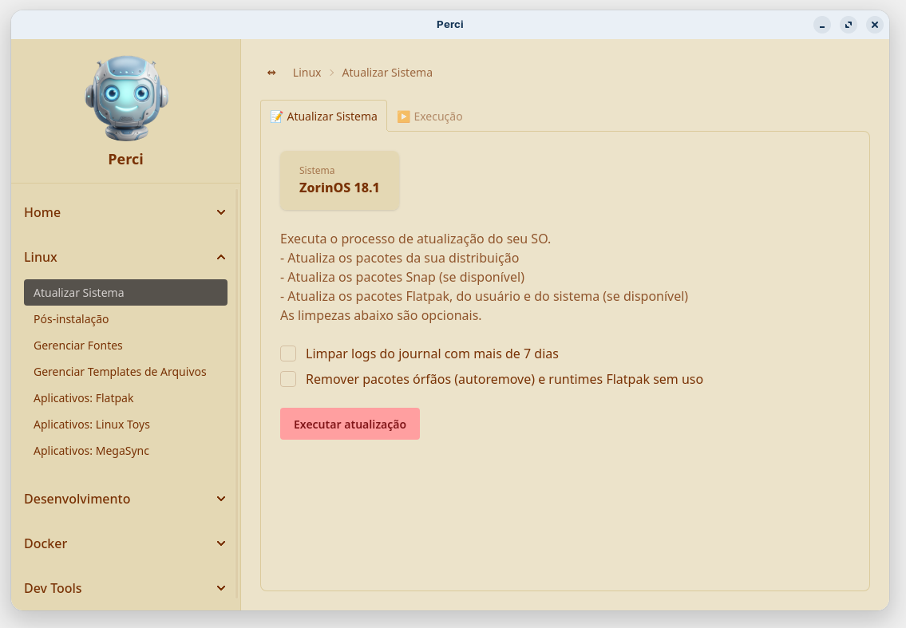

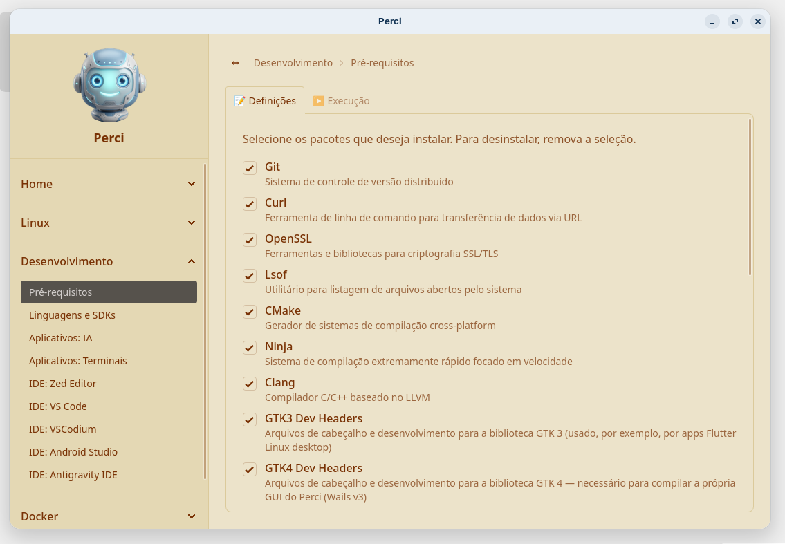

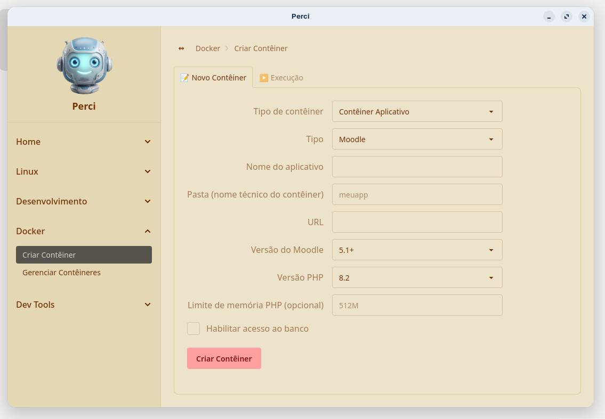

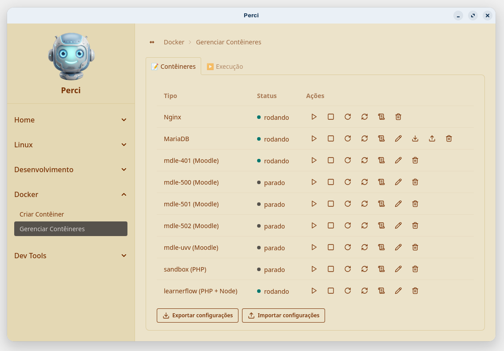

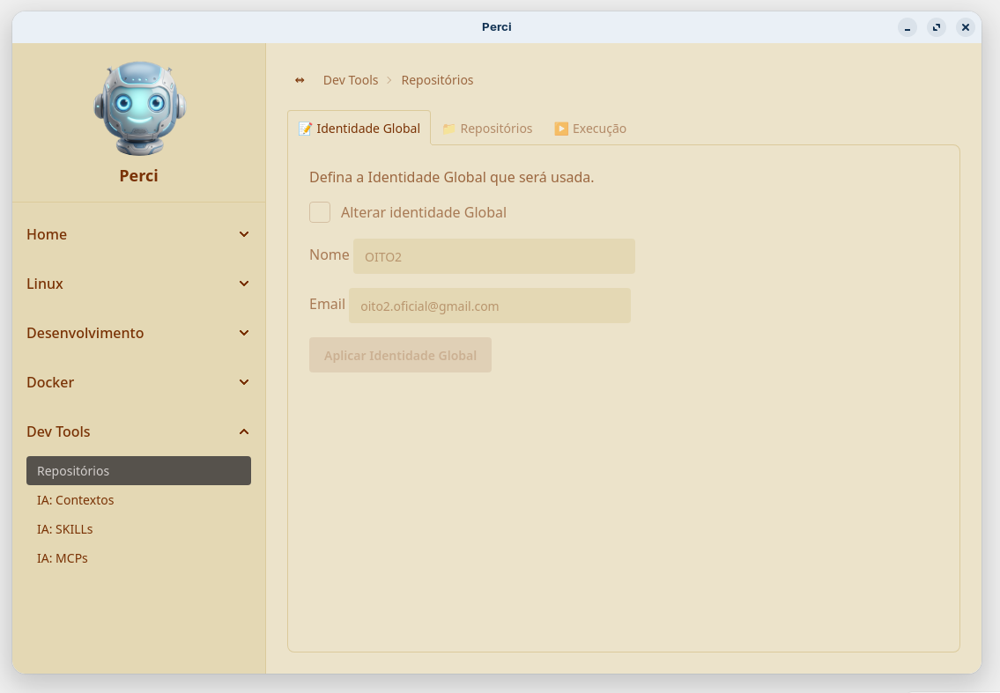

#### Temas

**Home → Configurações** troca o tema da GUI na hora — a mesma tela em cada um dos oito temas:

<table>
  <tr>
    <td align="center">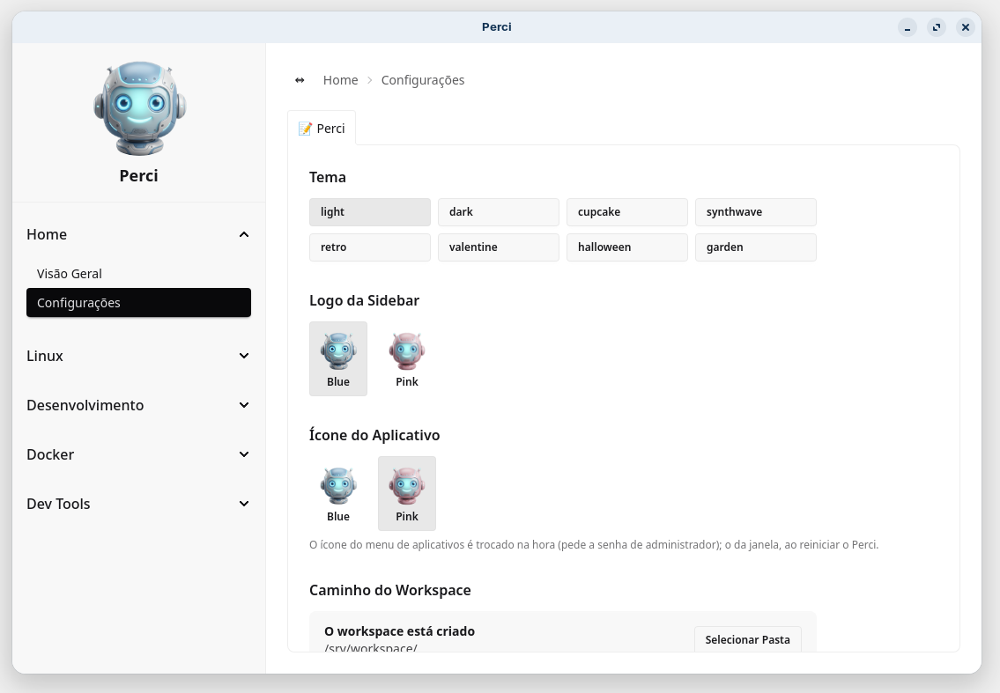 <code>light</code></td>
    <td align="center">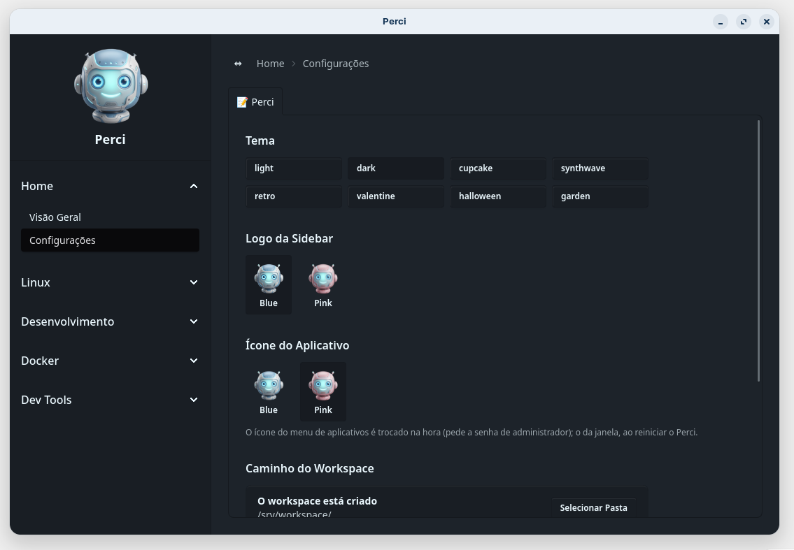 <code>dark</code></td>
  </tr>
  <tr>
    <td align="center">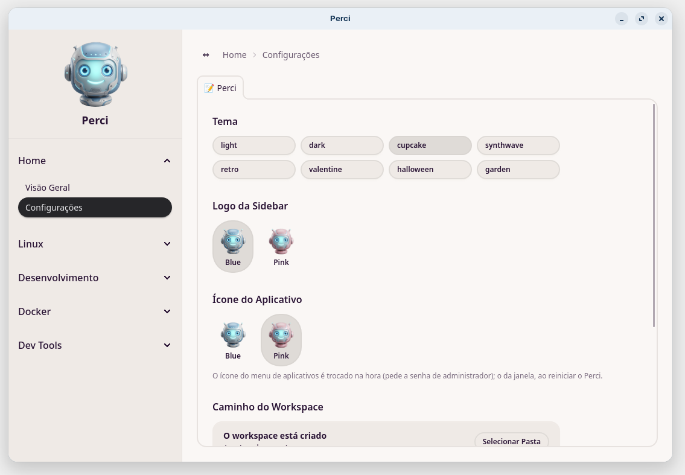 <code>cupcake</code></td>
    <td align="center">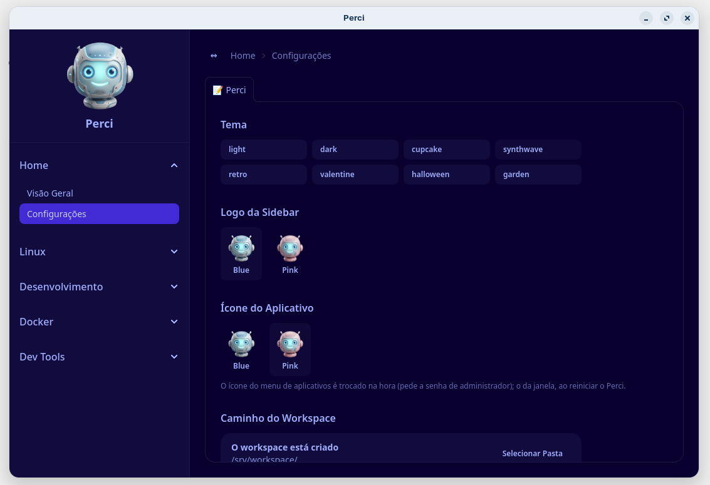 <code>synthwave</code></td>
  </tr>
  <tr>
    <td align="center">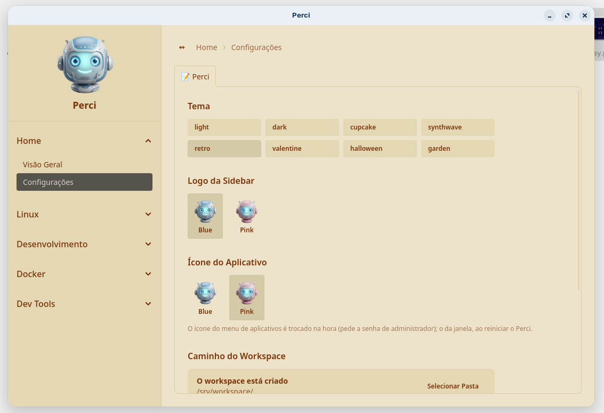 <code>retro</code></td>
    <td align="center">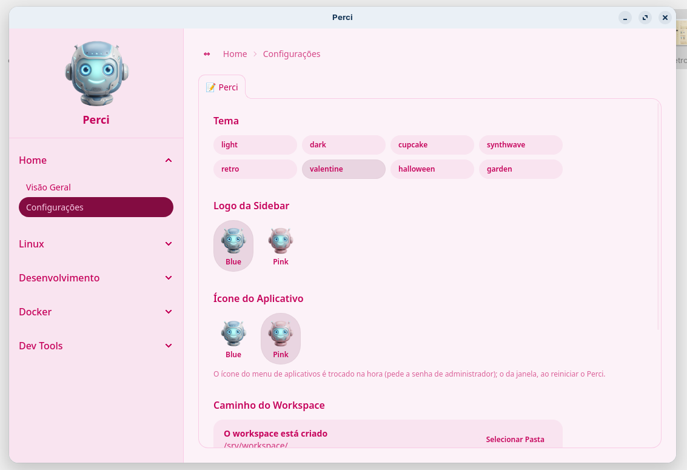 <code>valentine</code></td>
  </tr>
  <tr>
    <td align="center">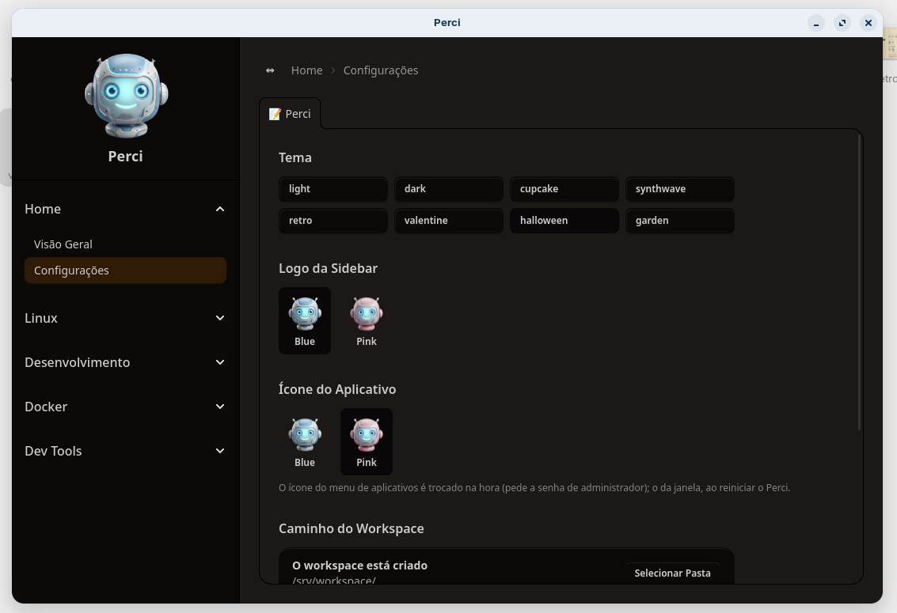 <code>halloween</code></td>
    <td align="center">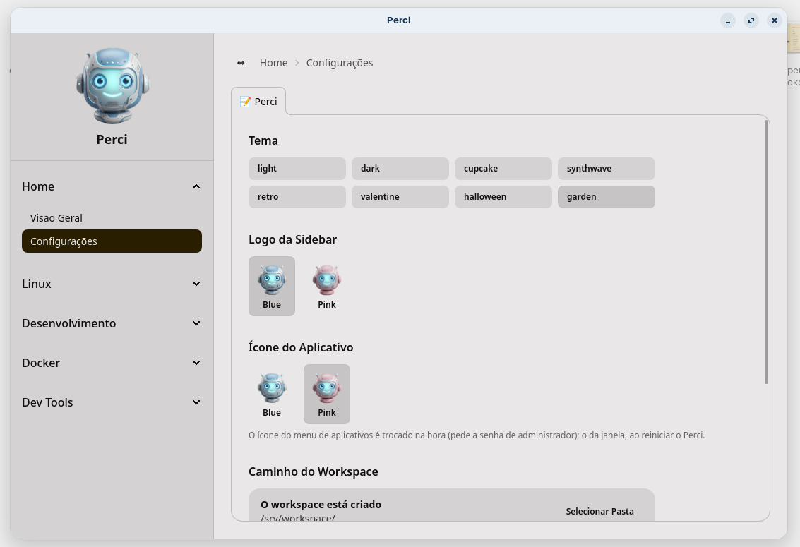 <code>garden</code></td>
  </tr>
</table>

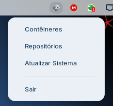

## Sensível à Distro, Não Agnóstico

Itens de menu ligados a uma combinação específica de distro/DE (as entradas de pós-instalação) somem por completo da categoria "Linux" quando não correspondem à máquina em que o perci se detecta rodando (`internal/distro`) — só a entrada da sua distro/DE real aparece. Tudo o mais (SDKs, a stack Docker de aplicativos, contexto IA, operações de banco) funciona igual independente da distro, desde que a família de distro (Debian ou Fedora) seja suportada.

## Config É o Único Estado Persistente

Fora do que cada recurso gera explicitamente (containers Docker, um arquivo `AGENTS.md`, uma fonte instalada), o perci em si só persiste uma coisa: `~/.perci/config.yaml`. Não há banco de dados, não há daemon, não há processo em segundo plano — toda ação é uma execução única e síncrona que lê a config, faz o trabalho (transmitindo sua saída para o próprio painel de terminal da GUI) e devolve o controle à barra lateral.

## Escalada de Privilégio É Centralizada

Todo comando que precisa de `sudo` passa por `internal/executor.Executor` — nenhum pacote de domínio chama `sudo` diretamente. É isso que torna possível analisar (e auditar) toda operação privilegiada que o perci pode realizar a partir de um único arquivo. Veja [Infraestrutura Central](../architecture/core-infra.md).

## Próximo

- [Visão geral da arquitetura](./architecture.md) para o mapa de componentes em nível de pacote.
