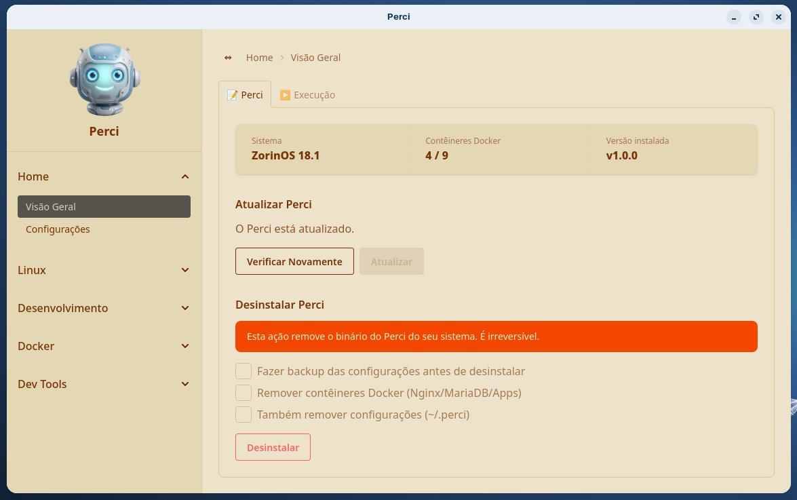

# perci.gnl

Um app de desktop para Linux que transforma uma instalação nova numa estação de desenvolvimento completa em minutos — pós-instalação, SDKs, IDEs e uma stack Docker por projeto, tudo numa janela só.

[](https://github.com/oito2/perci/releases)
[](https://go.dev)
[](https://kernel.org)
[](../../LICENSE)
[](https://github.com/oito2/perci/actions/workflows/ci.yml)
[](https://github.com/oito2/perci/actions/workflows/release.yml)

🌐 **Idioma:** [English](../../README.md) · Português

---

## Índice

- [Visão geral](#visão-geral)
- [Pré-requisitos e instalação rápida](#pré-requisitos-e-instalação-rápida)
- [Instalação automatizada](#instalação-automatizada)
- [Atualização e manutenção](#atualização-e-manutenção)
- [Documentação](#documentação)
- [Licença](#licença)

---

## Visão geral

> Este é um projeto bem pessoal. É o resultado de vários scripts `.sh` que eu já tinha, reunidos num único app Go.

> O objetivo é simples: chegar numa máquina nova e ter tudo o que preciso configurado em minutos. Por isso ele só cobre as distros que eu realmente uso no dia a dia: Linux Mint 22.3 (Cinnamon e XFCE), Ubuntu 26.04, Fedora 44 e ZorinOS 18.1 (Core e Lite).

> Sinta-se à vontade para usar e adaptar como quiser — mas é bom saber que ele resolve problemas bem específicos meus, não é uma ferramenta genérica pra qualquer setup.



Uma interface gráfica de desktop (Go + [Wails](https://wails.io)), cinco categorias na barra lateral, sem daemon, sem banco de dados — só `~/.perci/config.yaml`:

- **Home** — visão geral do seu sistema, atualizar/desinstalar o próprio Perci, configurações (tema, mascote da barra lateral, workspace, escopo Flatpak, bandeja do sistema).
- **Linux** — pós-instalação sensível a distro/DE, atualizações de sistema, fontes, modelos de arquivos, aplicativos Flatpak, Linux Toys, MegaSync.
- **Desenvolvimento** — pré-requisitos de build, SDKs Go/Flutter, aplicativos de IA, terminais, IDEs (Zed, VS Code, VSCodium, Android Studio, Antigravity).
- **Docker** — stack Docker por projeto (contêineres Nginx/MariaDB/PHP/Node/PHP+Node, com roteamento Moodle), criar e gerenciar contêineres.
- **Dev Tools** — controle de repositórios Git, geração de contexto de IA (`AGENTS.md`/`CLAUDE.md`/`.instructions/*.md`), skills de agente de IA, registro de servidores MCP.

Um ícone opcional na bandeja do sistema dá acesso rápido a contêineres, repositórios e atualizações do sistema numa janela compacta.

---

## Pré-requisitos e instalação rápida

| SO | Status | Distribuições | Dependências de execução |
|---|---|---|---|
| Linux (`amd64`) | Suportado | Baseadas em Debian/Ubuntu e Fedora — experiência completa no Linux Mint 22.3, Ubuntu 26.04, Fedora 44, Zorin OS 18.1 | GTK4, WebKitGTK 6.0 |
| Windows | Não suportado | — | — |
| macOS | Não suportado | — | — |

A escalada de privilégio (`pkexec`/PolicyKit), o gerenciamento de pacotes (`apt`/`dnf`), a detecção de distro e a stack gráfica GTK4 são todos específicos de Linux — veja [Instalação → Plataformas Suportadas](./getting-started/installation.md#plataformas-suportadas).

**1. Bibliotecas de execução** (normalmente já presentes numa instalação desktop):

```bash
# Baseado em Debian/Ubuntu
sudo apt install -y libgtk-4-1 libwebkitgtk-6.0-4

# Fedora
sudo dnf install -y gtk4 webkitgtk6.0
```

**2. Compilar e instalar a partir do código-fonte** (requer Go 1.26+):

```bash
# Dependências de build — baseado em Debian/Ubuntu
sudo apt install -y libgtk-4-dev libwebkitgtk-6.0-dev
# Dependências de build — Fedora
sudo dnf install -y gtk4-devel webkitgtk6.0-devel

git clone https://github.com/oito2/perci.git
cd perci
make install    # compila ./prci e instala em /usr/local/bin com o alias `perci` e a entrada no menu
```

**3. Execute** — pelo menu de aplicativos, ou:

```bash
prci
```

Instalação manual do binário, artefatos de release e arquiteturas suportadas: **[Instalação](./getting-started/installation.md)**.

---

## Instalação automatizada

O instalador de uma linha baixa a release mais recente, verifica o checksum SHA-256, instala em `/usr/local/bin/prci` com o alias `perci` e adiciona a entrada no menu de aplicativos:

```bash
curl --proto '=https' --tlsv1.2 -fsSL https://raw.githubusercontent.com/oito2/perci/main/install.sh | bash
```

Requer `curl`, `jq`, `sha256sum` e `tar`.

---

## Atualização e manutenção

- **Instalado a partir de uma release:** abra o Perci e use **Home → Visão Geral → Atualizar Perci** — ele consulta a release mais recente no GitHub, verifica o checksum e substitui o binário.
- **Instalado a partir do código-fonte:** atualize e reinstale:
  ```bash
  git pull && make install
  ```

Para remover o Perci, veja **[Desinstalação](./getting-started/uninstallation.md)**.

---

## Documentação

Site de documentação bilíngue completo: **[docs/en/index.md](../en/index.md)** · **[docs/pt-br/index.md](./index.md)**

- [Por que o perci.gnl existe](./concepts/why-perci.md) · [Como funciona](./concepts/how-perci-works.md) · [Arquitetura](./concepts/architecture.md)
- [Referência de configuração](./reference/configuration.md)
- [Solução de problemas](./troubleshooting/common-issues.md)
- Contribuindo: [contribuindo.md](./contribuindo.md) · [Código de Conduta](./codigo-de-conduta.md)

---

## Licença

GPL-3.0 — veja [LICENSE](../../LICENSE).
